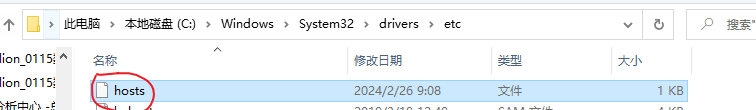
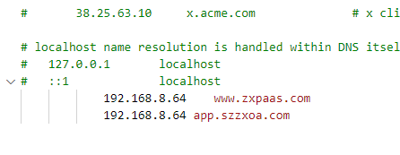
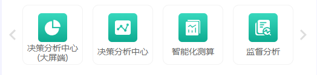
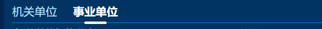
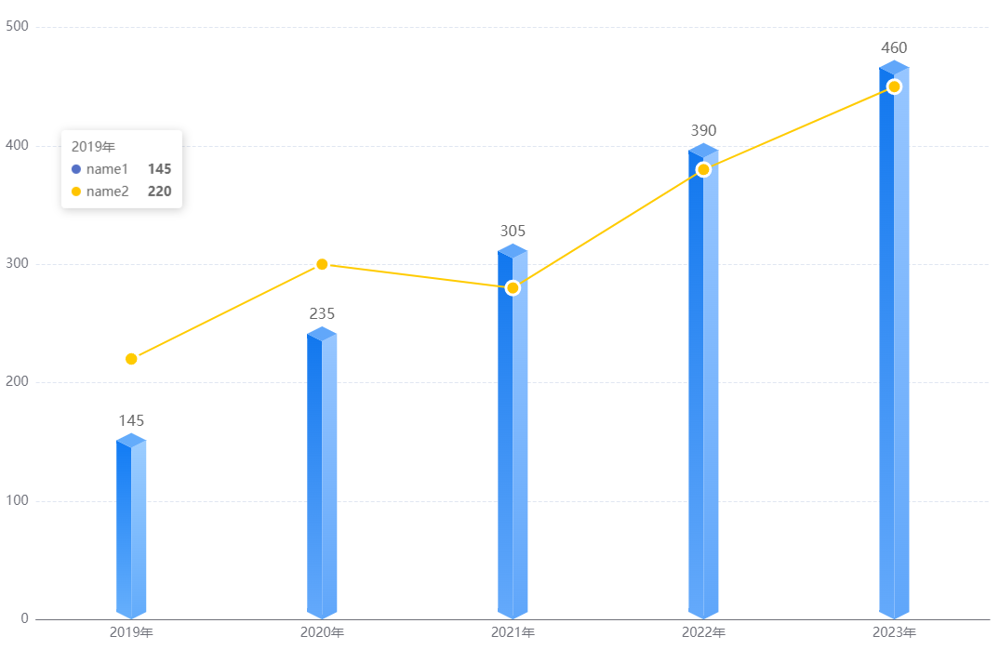
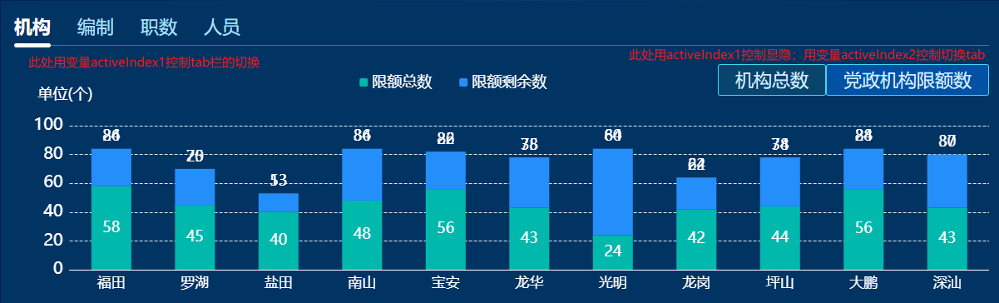
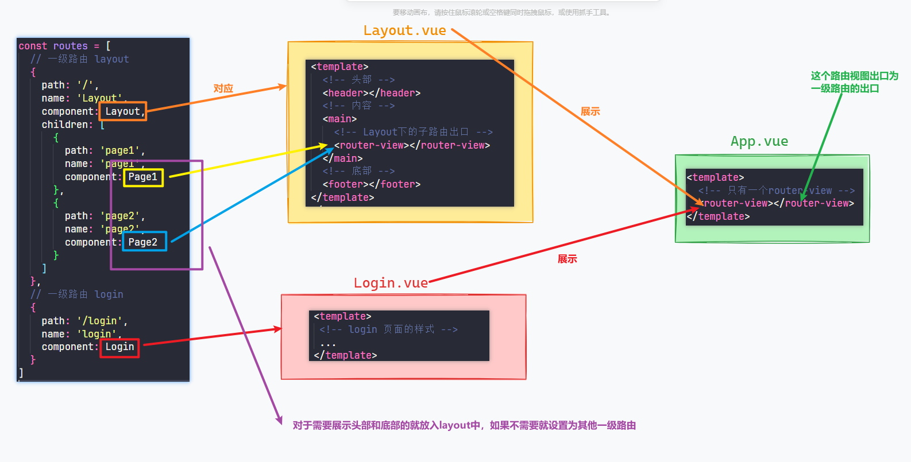
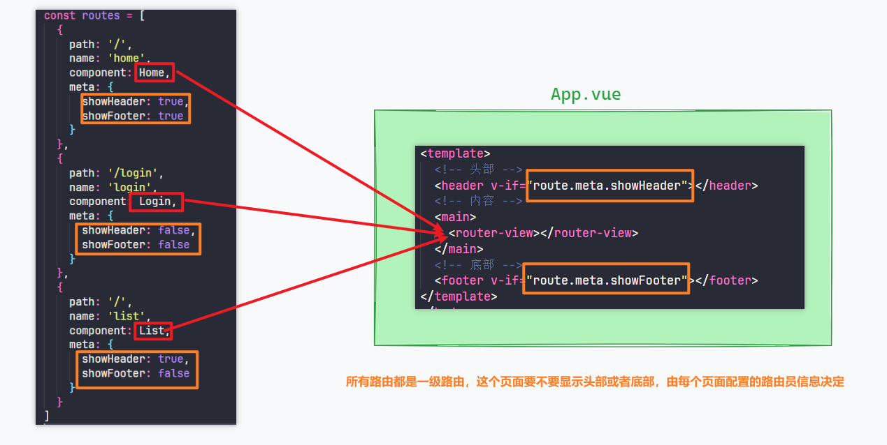

#### 更改host的地方





#### 树形的使用

1.不使用懒加载的情况，就很简单，直接利用一个接口拿到整个树形的全部数据，但是还需要将第一级的数据合并到这个数据里面（至少光明区这个接口获取到的是除了第一级光明区以外下一级及后面的全部数据），然后再给树形绑定这个数据，将这对应树形的唯一数据，如这一层级的id给新接口获取到指定树形层级的数据进行展示。（这里看光明纪委的审计报告的initData方法）    

2.使用懒加载的情况：这个时候我认为接口设计的肯定也是一级一级的，并不能直接拿到整个树形的全部数据，而是点击一级获得那一级树形的数据。这个树形是基于饿了么ui的树形写的，可以参考那个，大概知道怎么用，原理倒是不能完全理解

#### 级联选择器的使用

级联的懒加载这里用的很巧妙，首先开启懒加载，然后配置懒加载方法，直接将默认参数action, callback传入到配置的配置的函数中前者获得了这个节点的属性及这个节点的子节点的属性，后者就是饿了么里面懒加载会使用到的resolove，如this.treeload(action, callback)，之所以传入这两个参数，就是如上树形的使用2里面，由于树形是直接配置有这个两个树形作为默认参数，我们就相当于自己封装了一个和上面一样的函数，这两个参数也就相当于是树形懒加载里面的node和resolve参数了


#### keep-alive的用法之一

tab在后台项目中也比较常用的。假设我们有四个tab选项，每个tab都会向后端请求数据，但我们希望一开始只会请求当前的tab数据，而且tab来回切换的时候不会重复请求，只会实例化一次。首先我们想到的就是用`v-if` 这样的确能做到一开始不会挂载后面的tab，但有一个问题，每次点击这个tab组件都会重新挂载一次，这是我们不想看到的，这时候我们就可以用到`<keep-alive>`了。

<el-tabs v-model="activeTab">
  <el-tab-pane label="简介及公告" name="announcement">
    <announcement />
  </el-tab-pane>
  <el-tab-pane label="资讯" name="information">
    <keep-alive>
      <information v-if="activeTab=='information'" />
    </keep-alive>
  </el-tab-pane>
  <el-tab-pane label="直播流配置" name="stream">
    <keep-alive>
      <stream v-if="activeTab=='stream'" />
    </keep-alive>

  </el-tab-pane>

</el-tabs>

#### 闭包

比如防抖节流的时候return 一个函数，其实就是用到了闭包


#### 卓迅的图片，视频

前缀都需要加上这个/faas/fileapi/download/FastDFS/     然后最后一个斜杠后面一般都是那个请求回来那个fileList数组对应图片或者视频的id，


#### padding和margin的一个区别

比如背景，设置了padding会拉伸你的背景，而margin不会

#### 做登录页学到一种很好的方式

如下登录的两侧可以，将盒子变为border-box，然后可以直接给外部盒子padding，将内部的挤在一起，因为如下span标签账号和登录你肯定不能用flex里面的居中去做吧


#### 滑动滑块做法




1.这里面每一项是遍历div出来的，然后要用一个大的div包裹这个遍历出来的div，然后再用一个div包裹这个div，目前就是三层div ；我们要移动的是第二层这个包裹了遍历出来每一项的div，然后最外层那个div设置overflow：hidden，溢出隐藏，点击左右的时候，我们document.queryselector获取到这第二层div，每次移动25%，如下是点击向右移动时候移动滑块（过渡transition要放在移动的滑块div本身，也就是移动遍历出来的整个div，移动遍历出来的每一个也可以实现，但是不如移动整体）

let bigdiv = document.querySelector('.bigdiv')

if (this.clickIndex < 0) {

 this.clickIndex++

 bigdiv.style.transform = `translateX(${(this.clickIndex) * 20}%)`


#### tab栏切换


方法1：设置一个公共样式active ，设置一个变量activeIndex=0，tab栏遍历出来，当index===activeIndex的时候添加上公共样式active

方法2：遍历整个tab栏给你点击那个添加你设置的样式 不如方法1好用

方法3：学到的新方法，在遍历的时候每一项下面都放一个白色线，利用activeIndex，当你点击哪一项，index===activeIndex 显示出下面那条白线，其他的每一项只不过白色线隐藏了 。




#### 关于路由


#### 关于修改和新增

一般是同一个接口，区分在于新增传参是不带一个特有的id的，当传参携带有特有的id时，会被判断为修改，而不是新增；而点击修改就是让你新增的地方填上你需要修改的原内容即可，假设表格绑定的时form对象，当你修改时就会让这个form等于你需要修改的对应的内容

#### 实习学到的东西：可以说知道大致如何用地图实现实时变化


想实现删掉最下面这个方块 然后这个方块所占位置立刻删除掉的效果 ，而不是说删掉了最下面这个方块，这个方块所占的位置还存在，就需要将全部内容放到这三条方块里面，才能实现删掉最底下的组件，原本这个组件所占位置自动删除，并且整个页面只能又这三列


##### this.$forceUpdate()方法

此方法是强制刷新，可以让数组或对象新添加的属性依然具有响应式，和this.$set()方法的效果类似

如下示例 点击按钮会让上面这个对象原本不具有的属性显现，不用这个方法或this.$set()是显现不出来的，因为丢失了响应式

```vue
<p v-if="userInfo.age">{{userInfo.age}}</p>
<button @click="updateName">修改userInfo</button>
 data() {
    return {
      userInfo:{name:'小明'}
    };
  },

updateName(){
      this.userInfo.age=11
      this.$forceUpdate()
    },
```

#### 一个可以在指定范围移动的机器人


做法：首先获取到机器人这个dom元素  机器人的id是movediv   ，核心是三个事件，点击机器是事件 mousedown，鼠标移动事件document.onmousemove，然后松开鼠标  document.onmouseup的时候清除鼠标移动事件。

```javascript
const ele = document.getElementById('movediv')

ele.addEventListener('mousedown', (event) => {
  const totalHeight = window.innerHeight
  const totalWidth = window.innerWidth
  this.isMove = false
  this.disX = event.clientX - ele.offsetLeft;
  this.disY = event.clientY - ele.offsetTop;
  //2， 获取拖动元素的高度和容器的高度 为了下面进行限制元素拖动的范围
  let dragHeight = ele.offsetHeight;
  let dragWidth = ele.offsetWidth;
  // 添加鼠标移动事件
  document.onmousemove = (el) => {
    this.isMove = true
    // 3，获取鼠标移动位置
    let moveX = el.clientX - this.disX;
    let moveY = el.clientY - this.disY;
    // 4，限制拖动
    //控制范围：在元素 被拖拽的过程中 判断 元素的定位值 是否到达边界 如果到了 就不能在走了
    //4.1第一种 限制范围的判断
    // if(moveX <=0 || moveY <=0){ // 控制上边界和左边界
    //   return
    // }
    // if(moveX >= dragContainerWidth - dragWidth || moveY >= dragContainerHeight - dragHeight){
    //   return
    // }
    // 4.2 第二种限制方位的判断 建议使用第二种； 第一种靠边时经常会有边距，不太丝滑
    // 左边界
    if (moveX <= 10) {
      moveX = 10;
    }
    // 右边界 减去的值为div的宽度
    if (moveX >= totalWidth - 100) {
      moveX = totalWidth - 100;
    }
    // 上边界
    if (moveY <= 50) {
      moveY = 50;
    }
    // 上边界减去的值为div的高度
    if (moveY >= totalHeight - 100) {
      moveY = totalHeight - 100;
    }
    // 5, 开始移动
    ele.style.left = moveX + "px";
    ele.style.top = moveY + "px";
  };
  /* 6，鼠标抬起解除事件 */
  document.onmouseup = () => {
    document.onmousemove = null;
  };
})
```


#### queryselectorall和getelementsbyclassname区别

两者的相同点：返回值都是一个nodelList集合，也就是伪数组

document.getElementsByClassName兼容IE9及以上，是动态查询的过程，会随着dom结构的变化，得到的结点列表也会发生变化

querySelectorAll是css3中新增的选择器，兼容IE8及以上，得到的是一个静态列表，它不会对dom结构进行动态查询，也就是说不是实时的

```javascript
<div class="wrap">
    <div class="block"></div>
    <div class="block"></div>
    <div class="block"></div>
</div>
<script>
//下面这样修改某一个具有block类名的元素的类名为其他 ，获取到的是更新后的，而用querySelectorAll，获取的是死的，哪怕你修改过好依然获取的到
    var block=document.getElementsByClassName("block");
    var wrap=document.getElementsByClassName("wrap")[0];
    block[1].className="b";
    for(var i=0;i<block.length;i++){
        block[i].style.backgroundColor="red";
    }
</script>
```

柱状图级折线图常用属性（这两种基本使用是一样的）


```javascript
const data1 = [0.21, 0.35, 0.45, 0.21, 0.33]
const data2 = [0.1, 0.2, 0.3, 0.1, 0.2]

const option = {
  //在整个柱状图里显示的那个标签，每一个series的name需要和这个名字一致
  legend: {
    x: '33%',
    y: '5%',
    data: ['医生与患者比例', '护士与患者比例',],
    itemGap: 33, // 设置图例项之间的间隔宽度
  },
  tooltip: {
    trigger: 'axis',
    axisPointer: {
      type: 'cross',
      crossStyle: {
        color: '#999'
      }
    }
  },
    //echarts图的位置
  grid: {
    left: '2%',
    right: '2%',
    top: '17%',
    bottom: '2%',
    containLabel: true
  },
    //x轴
  xAxis: {
    type: 'category',
    axisTick: {
      // 轴刻度
      show: false,
    },
    axisLabel: {
      // 设置字体属性
      textStyle: {
        fontSize: 14,   // 字体大小
      }
    },
    data: ['2019', '2020', '2021', '2022', '2023']
  },
  yAxis: {
    type: 'value',
    axisTick: {
      show: false, // 显示刻度
      interval: 20 // 指定刻度间隔
    },
    axisLabel: {
      // 设置字体属性
      textStyle: {
        fontSize: 14,   // 字体大小
      }
    },
    splitLine: {
      show: true,
      lineStyle: {
        type: 'dashed',  // 设置为虚线
        // color: 'rgba(0, 0, 0, 0.3)'  // 设置虚线的颜色
      }
    }
  },
    //具体的要展示在echarts上的参数
  series: [
    {
      name: '医生与患者比例',
      type: 'line',
      // 平滑曲线
      // smooth: true,
      // 拐点数据及样式
      symbol: 'circle',
      symbolSize: 11,
      data: data1,
      //折线的属性
      itemStyle: {
        color: 'rgba(17, 119, 238)',
        borderColor: 'white',  // 设置拐点边框颜色
        borderWidth: 3,
        shadowColor: 'rgba(0, 0, 0, 0.15)',  // 设置阴影颜色
        shadowBlur: 2.5      // 设置阴影模糊度
      },
      lineStyle: {
        width: 1.2   // 设置折线的宽度
      },
      areaStyle: {
        normal: {
          // 线性渐变，前四个参数分别是 x0, y0, x2, y2, 范围从 0 - 1，相当于在图形包围盒中的百分比，如果 globalCoord 为 `true`，则该四个值是绝对的像素位置
          color: {//分隔区域的颜色
            x0: 0,
            y0: 0,
            x2: 0,
            y2: 1,
            colorStops: [{
              offset: 0,
              color: "rgba(17, 119, 238, 0.3)" // 0% 处的颜色
            }, {
              offset: 1,
              color: "rgba(17, 119, 238, 0)" // 100% 处的颜色；中间还可以设置50%、20%、70%时的颜色
            }],
            globalCoord: false // 缺省为 false，以确保上面的x,y,x2,y2表示的是百分比
          }
        }
      }
    },
    {
      name: '护士与患者比例',
      type: 'line',
      // 平滑曲线
      // smooth: true,
      // 拐点数据及样式
      symbol: 'circle',
      symbolSize: 11,
      data: data2,
      //折线的属性
      itemStyle: {
        color: 'rgba(62, 180, 90)',
        borderColor: 'white',  // 设置拐点边框颜色
        borderWidth: 3,
        shadowColor: 'rgba(0, 0, 0, 0.15)',  // 设置阴影颜色
        shadowBlur: 2.5      // 设置阴影模糊度
      },
      lineStyle: {
        width: 1.2  // 设置折线的宽度
      },
      areaStyle: {
        normal: {
          // 线性渐变，前四个参数分别是 x0, y0, x2, y2, 范围从 0 - 1，相当于在图形包围盒中的百分比，如果 globalCoord 为 `true`，则该四个值是绝对的像素位置
          color: {//分隔区域的颜色
            x0: 0,
            y0: 0,
            x2: 0,
            y2: 1,
            colorStops: [{
              offset: 0,
              color: "rgba(62, 180, 90, 0.25)" // 0% 处的颜色
            }, {
              offset: 1,
              color: "rgba(62, 180, 90, 0)" // 100% 处的颜色；中间还可以设置50%、20%、70%时的颜色
            }],
            globalCoord: false // 缺省为 false，以确保上面的x,y,x2,y2表示的是百分比
          }
        }
      }
    },

  ]
}
```

柱状图比较经典的一个


```javascript
const data1 =  "福田区",
  "南山区",
  "龙华区",
  "宝安区",
  "龙岗区",
  "罗湖区",
  "光明区",
  "盐田区",
  "坪山区",
  "大鹏新区",
  "深汕合作区"
]
const data2 = [180, 200, 340, 430, 520, 400, 500, 555, 222, 333, 111]
const data3 = [80, 100, 240, 330, 420, 500, 300, 355, 242, 433, 211]
const option = {
    //标题 如上的单位：万人，还要副标题
     title: {
        text: '单位：万人',  // 设置柱状图的标题文本
        // subtext: '单位：万人',  // 设置柱状图的副标题文本
        textStyle: {
            fontSize: 15,        // 设置标题字体大小
            fontWeight: '400'   // 设置标题字体粗细
        },
        // left: 'center',         // 设置标题水平居中
        // top: 'top'
        x: '0%',
        y: '5%'
    },
    //图内顶部的那个显示管辖社区和居民小组那个地方
    legend: {
        x: '40%',
        y: '5%',
        data: ['管辖社区', '居民小组'],
        itemGap: 33, // 设置图例项之间的间隔宽度
    },
    
    // 提示，这个提示就是上面图里面你触摸柱显示的，很重要，基本每个chart都需要显示
    tooltip: {
        trigger: 'axis',
        axisPointer: {
            type: 'cross',
            crossStyle: {
                color: '#1bcb61'
            }
        }
    },
    grid: {
        left: '0%',
        right: '0%',
        top: '18%',
        bottom: '0%',
        containLabel: true
    },
    xAxis: {
        type: 'category',
        axisTick: {
            show: false
        },
        data: data1,
        axisLabel: {
            fontSize: 14,   // 设置字体大小
            color: '#666666',
            interval: 0,//坐标轴刻度之间的间距
            formatter: function (val) {
                let result = ''
                const textLength = val.length
                const limitNumber = 4 // 一行显示几个字
                if (textLength > limitNumber) {
                    for (var i = 0; i < textLength; i += limitNumber) {
                        result += val.substring(i, i + limitNumber) + '\n'
                    }
                    result = result.trim() // 移除最后一个换行符
                } else {
                    result = val
                }
                return result
            }
        }
    },
    yAxis: {
        type: 'value',
        splitLine: {
            show: true,
            lineStyle: {
                type: 'dashed'
            }
        }
    },
    series: [
        {
            name: '管辖社区',
            data: data2,
            type: 'bar',
            barWidth: 9, // 柱宽度
            itemStyle: {
                normal: {
                    // barBorderRadius: 30, // 柱设置圆角
                    color: new echarts.graphic.LinearGradient(
                        0, 0, 0, 1,
                        [
                            { offset: 0, color: 'rgba(17, 119, 238, 1)' },   // 渐变起始颜色
                            { offset: 1, color: 'rgba(193, 221, 255, 1)' }    // 渐变结束颜色
                        ]
                    )
                }
            }
        },
        {
            name: '居民小组',
            data: data3,
            type: 'bar',
            barWidth: '9', // 柱宽度
            itemStyle: {
                normal: {
                    // barBorderRadius: 30, // 柱设置圆角
                    color: new echarts.graphic.LinearGradient(
                        0, 0, 0, 1,
                        [
                            { offset: 0, color: 'rgba(78, 188, 126, 1)' },   // 渐变起始颜色
                            { offset: 1, color: 'rgba(166, 242, 199, 1)' }    // 渐变结束颜色
                        ]
                    )
                }
            }
        },
    ]
};

return option
```

饼状图


```javascript
let data1 = [
  { value: 23, name: '司法专项编制  ' },
  { value: 10, name: '党群机关编制' },
  { value: 6, name: '街道行政编制' },
  { value: 61, name: '检察院专项编制 ' },
  { value: 20, name: '公安专项编制 ' },

];


const option = {

  tooltip: {
    trigger: 'item'
  },
  color: ['#8fdc15', '#1177ee', '#2dcfdb', '#3fc2b5', '#3ccc33',],
  series: [
    {
      type: 'pie',
      //饼图控制大小和内部空心的大小 ，45%表示内半径为容器宽度和高度的50%。75%是外半径
      radius: ['45%', '75%'],
      //饼图的位置
      center: ['43%', '50%'],
      // label是饼状图每一部分显示出来有多少的那个标签
      label: {

        show: true,
        // 下面这两种方法都可以显示饼状图每一项所占的总量的百分比，应该都是echarts封装好的
        // 下面这样就直接显示是换行的形式
        formatter: function (data) {
          return `${data.name}
${data.percent.toFixed(0)}%`
        },
          
          //下面这个formatter可以限制，当标签字数超过多少就换行
     //       formatter: function (data) {
          //   下面也可以用\n来换行 但是不好 不好限制句首间距
       //   return data.name.length < 5 ? `${data.name} : ${data.value}人
         // 占比 : ${data.percent.toFixed(0)}%` : `${data.name.slice(0, 5)}
//${data.name.slice(5)}: ${data.value}人
//占比 : ${data.percent.toFixed(0)}%`
        },
          
        textStyle: {
          fontSize: 14,
          lineHeight: 20,
          color: '#000'
          // 其他样式属性，比如 fontFamily、align、verticalAlign 等
        },
        // 标签线
        // labelLine: {
        //   show: true, // 是否显示标签线
        //   length: 20, // 标签线长度
        //   length2: 20, // 标签线第二段长度
        //   smooth: false, // 是否平滑曲线

        // },
      },
      data: data1,
      emphasis: {
        itemStyle: {
          shadowBlur: 10,
          shadowOffsetX: 0,
          shadowColor: 'rgba(0, 0, 0, 0.5)'
        }
      }
    }
  ]
}
return option
```

饼状图，一个option展示多个饼状图，下面用formater处理的东西是独立的，我之前做的是会共享数据。


```js
let data1 = [
  { value: 200, name: '35岁以下' },
  { value: 40, name: '35岁-44岁' },
  { value: 44, name: '45岁-54岁' },
  { value: 60, name: '55岁以上' },
];
let data2 = [
  { value: 220, name: '本科' },
  { value: 84, name: '硕士研究生' },
  { value: 40, name: '博士研究生' },
]


const option = {
  tooltip: {
    trigger: 'item',
    // formatter: "{a} <br/>{b}: {c} ({d}%)"
  },
  // 饼状图中心的文字，在柱状图中也有这个属性
  title: [{
    text: '年龄',
    // itemGap: 15,
    x: '26.5%',
    y: '34%',
    textAlign: 'center',
    textStyle: {
      fontFamily: 'Microsoft YaHei',
      fontSize: '16',
      fontStyle: 'normal',
      fontWeight: '500',
      color: '#666666'
    },
  },
  {
    text: '学历\n结构',
    fontFamily: 'Microsoft YaHei',
    x: '69.5%',
    y: '29%',
    textAlign: 'center',
    textStyle: {
      fontSize: '16',
      fontStyle: 'normal',
      lineHeight: 22,
      color: '#666666',
      fontWeight: '500',
    },
  }
  ],
  // 饼状图内饼旁边一直显示的提示信息文字
  legend: [
    {
      orient: 'vertical',
      // show: false,
      left: '10.5%',
      top: '73%',
      itemWidth: 10,
      itemHeight: 25,
      padding: [0, 5],
      itemGap: 15,
      icon: 'circle',
      textStyle: {
        fontSize: '14px',
      },
        //和下面那个饼状图的legend独立
      formatter: function (name) {
        let value
        for (var item of data1) {
          if (item.name == name) {
            value = item.value
          }
        }
        return name + ' ' + value + '人';
      },
        //此处切记一定一定要把对应data的数据放在这里，如果不放，默认会把另外一个图的数据也再这个图上显示，由于没有另外一个图的数据，所以会显示undefined，所以此处必须放data，data是你穿的指定参数
      data: data1
    },
    {
      orient: 'vertical',
      // show: false,
      left: '63%',
      top: '70%',
      itemGap: 15,
      // padding: [0, 10],
      itemWidth: 10,
      itemHeight: 35,
      icon: 'circle',
      textStyle: {
        fontSize: '14px',
      },
      formatter: function (name) {
        let value
        for (var item of data2) {
          if (item.name == name) {
            value = item.value
          }
        }
        return name + ' ' + value + '人';
      },
      data: data2
    },
  ],

  series: [
    {
      type: 'pie',
      radius: ['37%', '51%'],
      center: ['27%', '37%'], // 调整饼图位置
      label: {
        normal: {
          show: false,
        },
        // emphasis: {
        //   show: true,
        // }
      },
      data: data1,
      color: ['#637fff', '#44d3ff', '#4cf373', '#ff78b7'],
    },
    {
      type: 'pie',
      radius: ['37%', '51%'],
      center: ['70%', '37%'], // 调整饼图位置
      label: {
        normal: {
          show: false,
        },
        // emphasis: {
        //   show: true,
        // }
      },
      data: data2,
      color: [new echarts.graphic.LinearGradient(0, 0, 0, 1, [{
        offset: 0,
        color: `#00d0fb`
      }, {
        offset: 1,
        color: `#3485ff`
      }]), new echarts.graphic.LinearGradient(0, 0, 0, 1, [{
        offset: 0,
        color: `#fff0b2`
      }, {
        offset: 1,
        color: `#ffd21e`
      }]), new echarts.graphic.LinearGradient(0, 0, 0, 1, [{
        offset: 0,
        color: `#ff92b4`
      }, {
        offset: 1,
        color: `#ff749f`
      }])],
      // 饼图每一部分有间隙
      itemStyle: {
        borderWidth: 2,	//边框的宽度
        borderColor: 'white',	//边框的颜色
        shadowBlur: 10,  // 阴影模糊度
        shadowColor: 'rgba(0, 0, 0, 0.1)',  // 阴影颜色
        shadowOffsetX: 3,  // 阴影水平偏移量
        shadowOffsetY: 3,  // 阴影垂直偏移量
      },
    },

  ]
};
return option
```



```js
let name = ['2019年', '2020年', '2021年', '2022年', '2023年'];
let value = [145, 235, 305, 390, 460];
let value2 = [220, 300, 280, 380, 450];
let toolTims = null
const offsetX = 16;
const offsetY = 8;
// 绘制左侧面
const CubeLeft = echarts.graphic.extendShape({
   shape: {
      x: 0,
      y: 0,
   },
   buildPath: function (ctx, shape) {
      const xAxisPoint = shape.xAxisPoint;
      const c0 = [shape.x, shape.y];
      const c1 = [shape.x - offsetX, shape.y - offsetY];
      const c2 = [xAxisPoint[0] - offsetX, xAxisPoint[1] - offsetY];
      const c3 = [xAxisPoint[0], xAxisPoint[1]];
      ctx.moveTo(c0[0], c0[1]).lineTo(c1[0], c1[1]).lineTo(c2[0], c2[1]).lineTo(c3[0], c3[1]).closePath();
   },
});
// 绘制右侧面
const CubeRight = echarts.graphic.extendShape({
   shape: {
      x: 0,
      y: 0,
   },
   buildPath: function (ctx, shape) {
      const xAxisPoint = shape.xAxisPoint;
      const c1 = [shape.x, shape.y];
      const c2 = [xAxisPoint[0], xAxisPoint[1]];
      const c3 = [xAxisPoint[0] + offsetX, xAxisPoint[1] - offsetY];
      const c4 = [shape.x + offsetX, shape.y - offsetY];
      ctx.moveTo(c1[0], c1[1]).lineTo(c2[0], c2[1]).lineTo(c3[0], c3[1]).lineTo(c4[0], c4[1]).closePath();
   },
});
// 绘制顶面
const CubeTop = echarts.graphic.extendShape({
   shape: {
      x: 0,
      y: 0,
   },
   buildPath: function (ctx, shape) {
      const c1 = [shape.x, shape.y];
      const c2 = [shape.x + offsetX, shape.y - offsetY]; //右点
      const c3 = [shape.x, shape.y - offsetX];
      const c4 = [shape.x - offsetX, shape.y - offsetY];
      ctx.moveTo(c1[0], c1[1]).lineTo(c2[0], c2[1]).lineTo(c3[0], c3[1]).lineTo(c4[0], c4[1]).closePath();
   },
});
// 注册三个面图形
echarts.graphic.registerShape('CubeLeft', CubeLeft);
echarts.graphic.registerShape('CubeRight', CubeRight);
echarts.graphic.registerShape('CubeTop', CubeTop);
// 主体
 option = {
   // backgroundColor: "#010d3a",
   title: {
      // text: '测试',
      left: 'center',
      textStyle: {
         color: '#2B7BD6',
      },
   },
   tooltip: {
      trigger: 'axis',
      axisPointer: {
         type: 'shadow',
      },
      // formatter: function (params) {
      //   const item = params[1];
      //   return `${item.name}:${item.value }人`;
      // },
   },
   grid: {
      // width: "95%",
      // height: "95%",
      top: "8%",
      left: "2%",
      right: "2%",
      bottom: "5%",
      containLabel: true,
   },
   xAxis: {
      type: 'category',
      data: name,
      // X
      axisLine: {
         show: true,
         lineStyle: {
            // width: 1,
            // color: '#2B7BD6',
         },
      },
      axisTick: {
         show: false,
      },
      axisLabel: {
         fontSize: 14,
         interval: 0,
      },
   },
   yAxis: {
      // name: '人数',
      type: 'value',
      // y
      axisLine: {
         show: false,
         lineStyle: {
            // width: 1,
            // color: '#2B7BD6',
         },
      },
      splitLine: {
         show: true,
         // y-line
         lineStyle: {
            // width: 1,
            type: 'dashed',
            // color: '#153D7D',
         },
      },
      axisTick: {
         show: false,
      },
      axisLabel: {
         fontSize: 14,
      },
      // boundaryGap: ['20%', '20%'],
   },
   series: [
      // 柱体
      {
         name: 'name1',
         type: 'custom',
         renderItem: (params, api) => {
            const location = api.coord([api.value(0), api.value(1)]);
            return {
               type: 'group',
               children: [
                  {
                     type: 'CubeLeft',
                     shape: {
                        api,
                        xValue: api.value(0),
                        yValue: api.value(1),
                        x: location[0],
                        y: location[1],
                        xAxisPoint: api.coord([api.value(0), 0]),
                     },
                     style: {
                        fill: new echarts.graphic.LinearGradient(0, 0, 0, 1, [
                           {
                              offset: 0,
                              color: '#1177ee',
                           },
                           {
                              offset: 1,
                              color: '#65aafb',
                           },
                        ]),
                     },
                  },
                  {
                     type: 'CubeRight',
                     shape: {
                        api,
                        xValue: api.value(0),
                        yValue: api.value(1),
                        x: location[0],
                        y: location[1],
                        xAxisPoint: api.coord([api.value(0), 0]),
                     },
                     style: {
                        fill: new echarts.graphic.LinearGradient(0, 0, 0, 1, [
                           {
                              offset: 0,
                              color: '#97c6ff',
                           },
                           {
                              offset: 1,
                              color: '#5fa6fa',
                           },
                        ]),
                     },
                  },
                  {
                     type: 'CubeTop',
                     shape: {
                        api,
                        xValue: api.value(0),
                        yValue: api.value(1),
                        x: location[0],
                        y: location[1],
                        xAxisPoint: api.coord([api.value(0), 0]),
                     },
                     style: {
                        fill: new echarts.graphic.LinearGradient(1, 0, 0, 0, [
                           {
                              offset: 0,
                              color: '#61a7fa',
                           },
                           {
                              offset: 1,
                              color: '#61a7fa',
                           },
                        ]),
                     },
                  },
               ],
            };
         },
         data: value,
      },
      // bar顶部数量
      {
         name: '',
         type: 'bar',
         label: {
            normal: {
               show: true,
               position: 'top',
               formatter: (e) => {
                  return `${e.value}`;
               },
               fontSize: 16,
               color: '#666666',
               offset: [0, -15],
            },
         },
         itemStyle: {
            color: 'transparent',
         },
         tooltip: {
            show: false
         },
         data: value,
      },
      // 折线
      {
         name: 'name2',
         type: 'line',
         // barWidth: 30,
         // tooltip: {
         //   valueFormatter: function (value) {
         //     return value
         //   }
         // },
         symbolSize: 15,
         symbol: "circle",
         itemStyle: {
            normal: {
               color: '#ffc400',
               borderWidth: 3,
               borderColor: '#fff'
            }
         },
         data: value2,
      },
   ],
```


##### echarts触发例如点击事件 修改参数

我试过直接修改传入的值是不行的，利用下面的echarts配置的setOption方法就可以成功

```js
  this.$refs.myEchart.setOption({
    xAxis: {
      data: this.chartData.data1
    },
    series: [
      {
        data: this.chartData.data2
      }
    ]
  })

```

#### 多重tab栏切换



此处不同的tab栏的echarts图并不是用v-if显隐来控制，而是用this.$refs.myEchart.setOption({})，这个myEchart是refs标记的图表dom。如下当你点击上方tab栏，activeIndex1发生变化，并调用searchData2方法，此方法内用if判断了activeIndex1和activeIndex2变化时展示不同图表，点击下方tab栏activeIndex2发生变化，调用searchData方法，注意初始那个图表也要写在函数内，不然当你切换回初始的那个tab栏调用searchData方法时并没有那个的数据，外面默认初始的那个不用if包裹 视为默认情况，不知道为啥 用if包裹就会调用失败

首先默认是要初始化机构下的机构总数的图表  如下是setConfig方法

```js
const data1 = ['福田', '罗湖', '盐田', '南山', '宝安', '龙华', '光明', '龙岗', '坪山', '大鹏', '深汕']

const data2 = [1643, 1495, 628, 1136, 1974, 400, 786, 1956, 1835, 542, 192]
const data3 = [1370, 1429, 1077, 1136, 226, 600, 1905, 1445, 766, 1013, 980]
const data4 = data1.map((it, index) => {
    return data2[index] + data3[index]
})

const option = {
    title: {
        text: '单位(个)',  // 设置柱状图的标题文本
        // subtext: '单位：万人',  // 设置柱状图的副标题文本
        textStyle: {
            fontSize: 18,        // 设置标题字体大小
            fontWeight: '400',   // 设置标题字体粗细
            color: '#ffffff'
        },
        // left: 'center',         // 设置标题水平居中
        // top: 'top'
        x: '2%',
        y: '15%'
    },
    legend: {
        x: '35%',
        y: '10%',
        data: ['机关单位数', '事业单位数'],
        itemWidth: 10,
        itemHeight: 10,
        itemGap: 33, // 设置图例项之间的间隔宽度
        textStyle: {
            fontSize: '18px',
            color: '#ffffff'
        },
    },
    // 提示
    tooltip: {
        // trigger: 'axis',
        // axisPointer: {
        //     type: 'cross',
        //     crossStyle: {
        //         color: '#ccc'
        //     }
        // }
    },
    grid: {
        left: '2%',
        right: '0%',
        top: '32%',
        bottom: '2%',
        containLabel: true
    },
    xAxis: {
        type: 'category',
        data: data1,
        //刻度
        axisTick: {
            show: false
        },
        axisLine: {
            lineStyle: {
                color: '#ffffff'
            }
        },
        axisPointer: {
            show: true,
            label: {
                fontSize: 20,   // 字体大小
                color: '#000000',
            }
        },
        axisLabel: {
            // 设置字体属性
            textStyle: {
                fontSize: 17,   // 字体大小
                color: '#ffffff'
            }
        }
    },
    yAxis: {
        // name: '单位(个)',
        type: 'value',
        splitLine: {
            show: true,
            lineStyle: {
                type: 'dashed'
            }
        },
        axisLabel: {
            // 设置字体属性
            textStyle: {
                fontSize: 20,   // 字体大小
                color: '#ffffff'
            }
        },
        // axisPointer: {
        //     show: true,
        //     label: {
        //         color: '#ffffff',
        //     }
        // },
    },
    series: [
        {
            name: '机关单位数',
            type: 'bar',
            stack: 'barStack',  // 设置堆叠的名称
            barWidth: 48, // 柱宽度
            label: {
                show: true,
                textStyle: {
                    fontSize: 18,
                    color: '#fff'
                }
            },
            itemStyle: {
                color: '#ffcf30'
            },
            data: data2
        },
        {
            name: '事业单位数',
            type: 'bar',
            stack: 'barStack',  // 设置堆叠的名称，保持一致
            barWidth: 48, // 柱宽度
            label: {
                show: true,
                textStyle: {
                    fontSize: 18,
                    color: '#fff'
                }
            },
            itemStyle: {
                color: '#248efb'
            },
            data: data3
        },
        {
            name: '用于行政执法的编制',
            type: 'bar',
            stack: 'barStack',  // 设置堆叠的名称，保持一致
            barWidth: 48, // 柱宽度
            label: {
                show: true,
                textStyle: {
                    fontSize: 18,
                    color: '#fff'
                }
            },
            itemStyle: {
                color: '#248efb'
            },
            data: []
        },
        {
            name: '总数',
            type: 'bar',
            zlevel: -1,
            barWidth: 48,
            barGap: '-100%',
            label: {
                show: true,
                textStyle: {
                    fontSize: 18,
                    color: '#ffffff'
                },
                position: 'top',
                // distance: 15,
            },
            itemStyle: {
                color: 'transparent'
            },
            data: data4,
        },
    ]
};
return option
```

然后先配置机构下的tab栏切换 图标变化   方法名searchData

```js
const data1 = ['福田', '罗湖', '盐田', '南山', '宝安', '龙华', '光明', '龙岗', '坪山', '大鹏', '深汕']
let legendData = ['机关单位数', '事业单位数']
let name2 = '机关单位数'
let color2 = '#ffcf30'
let data2 = [1643, 1495, 628, 1136, 1974, 400, 786, 1956, 1835, 542, 192]
let name3 = '事业单位数'
let color3 = '#248efb'

let data3 = [1370, 1429, 1077, 1136, 226, 600, 1905, 1445, 766, 1013, 980]
if (this.activeIdx1 == 2) {
    legendData = ['限额总数', '限额剩余数']
    name2 = '限额总数'
    name3 = '限额剩余数'
    color2 = '#00b8ac'
    color3 = '#248efb'
    data2 = [58, 45, 40, 48, 56, 43, 24, 42, 44, 56, 43, 51]
    data3 = [26, 25, 13, 36, 26, 35, 60, 22, 34, 28, 37, 33]
} else {
}
const data4 = data1.map((it, index) => {
    return data2[index] + data3[index]
})
this.$refs.myEchart.setOption({
    legend: {
        data: legendData,
    },
    series: [
        {
            name: name2,
            itemStyle: {
                color: color2
            },
            data: data2
        },
        {
            name: name3,
            itemStyle: {
                color: color3
            },
            data: data3
        },
        {
            name: '',
            data: []
        },
        {
            data: data4,
        },
    ]
})
```

然后配置上方tab栏切换时图表变化情况  searchData2方法

```js
let data1 = ['福田', '罗湖', '盐田', '南山', '宝安', '龙华', '光明', '龙岗', '坪山', '大鹏', '深汕']
let legendData = ['机关单位数', '事业单位数']
let name2 = '机关单位数'
let color2 = '#ffcf30'
let data2 = [1643, 1495, 628, 1136, 1974, 400, 786, 1956, 1835, 542, 192]
let name3 = '事业单位数'
let color3 = '#248efb'
let data5 = []
let name4 = ''
let data4 = []
let positionType = ''

let data3 = [1370, 1429, 1077, 1136, 226, 600, 1905, 1445, 766, 1013, 980]
if (this.activeIdx == 1) {
    if (this.activeIdx1 == 2) {
        legendData = ['限额总数', '限额剩余数']
        name2 = '限额总数'
        name3 = '限额剩余数'
        color2 = '#00b8ac'
        color3 = '#248efb'
        data2 = [58, 45, 40, 48, 56, 43, 24, 42, 44, 56, 43, 51]
        data3 = [26, 25, 13, 36, 26, 35, 60, 22, 34, 28, 37, 33]
    }
    data4 = data1.map((it, index) => {
        return data2[index] + data3[index]
    })
} else if (this.activeIdx == 2) {
    legendData = ['行政编制', '政法专项编制', '用于行政执法的编制']
    name2 = '行政编制'
    name3 = '政法专项编制'
    color2 = '#ffcf30'
    color3 = '#00b8ac'
    data2 = [1643, 1495, 628, 1136, 1974, 500, 786, 914, 600, 542, 192]
    data3 = [1643, 1495, 628, 1136, 1974, 500, 786, 914, 600, 542, 192]
    data5 = [1370, 800, 3577, 1136, 226, 1000, 1905, 1896, 2569, 1013, 980]
    name4 = '用于行政执法的编制'
    data4 = data1.map((it, index) => {
        return data2[index] + data3[index] + data5[index]
    })
} else if (this.activeIdx == 3) {
    legendData = []
    name2 = ''
    name3 = ''
    color2 = '#248efb'
    positionType = 'top'
    color3 = ''
    data2 = [1620, 1495, 628, 1126, 1800, 2000, 700, 1956, 1850, 542, 182]
    data3 = []
    data5 = []
    name4 = ''
    data4 = []
} else if (this.activeIdx == 4) {
    data1 = ['党委系统', '人大系统', '政府系统', '政协系统', '民主党派系统', '群众团体系统', '法院系统', '检察院系统']
    legendData = []
    name2 = ''
    name3 = ''
    color2 = '#00b8ac'
    positionType = 'top'
    color3 = ''
    data2 = [50, 140, 489, 100, 130, 150, 100, 120]
    data3 = []
    data5 = []
    name4 = ''
    data4 = []
}

// const data4 = data1.map((it, index) => {
//     return data2[index] + data3[index]
// })
this.$refs.myEchart.setOption({
    legend: {
        data: legendData,
    },
    xAxis: {
        data: data1,
    },
    series: [
        {
            name: name2,
            itemStyle: {
                color: color2
            },
            label: {
                position: positionType,
                textStyle: {
                    fontSize: 18,
                    color: '#fff'
                }
            },
            data: data2
        },
        {
            name: name3,
            itemStyle: {
                color: color3
            },
            data: data3
        },
        {
            name: name4,
            data: data5
        },
        {
            data: data4,
        },
    ]
})
```


有个问题，为什么点击添加样式添加在一个我不明白的div上，首先直接添加在整个盒子上内部文字会跟着变化


##### tab栏切换


这个tab栏切换学习到的地方1：tab栏每一项长度不一样，想要间距一样，直接给遍历tab栏元素加个margin；2：如果点击添加样式，下方的横线和tab栏宽度一致直接用border做，如果像这里一样明显小于tab栏的每一项，长度还不一样，可以参考我这个这个方法，首先定位，然后自己一个个调试，找到合适的位移距离即可。


学习一下echarts地图的引入，以及自定义地图的地区，这里貌似要手动去描点，学习一下

树形在学一下 树形懒加载 和不用懒加载在vscode分别怎么使用

getBoundingClientRect()

vue的diff需要了解一下，实际开发中各种高度需要再复习一下，全忘记了，经常也会用到

类似下面地图这种效果 我后面有事件尝试学习一下


路由



